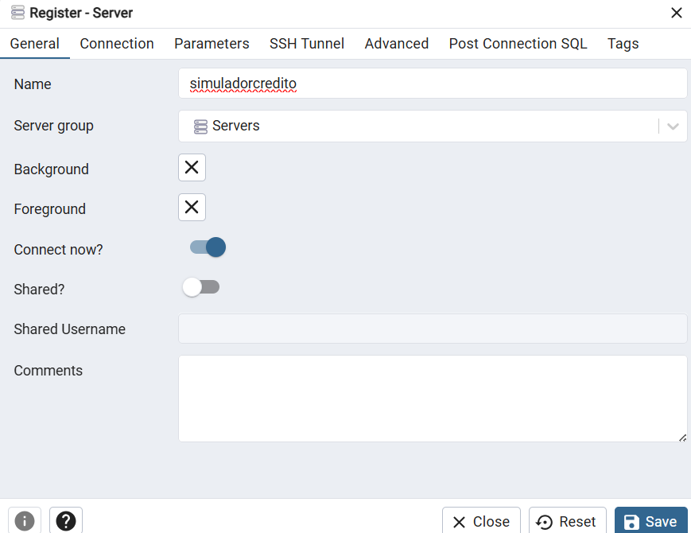
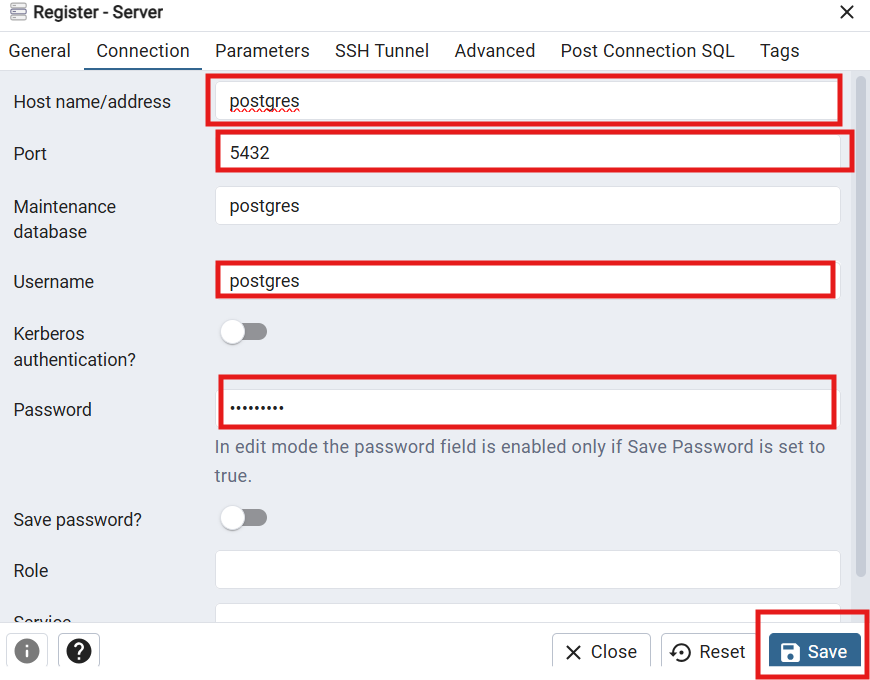

# 📊 Simulador de Crédito - Hackathon Caixa

Projeto desenvolvido durante o **Hackathon Caixa** com foco em **backend** utilizando [Quarkus](https://quarkus.io/), **Java 21**, **Docker** e **PostgreSQL**.  
O sistema expõe endpoints para **simulação de crédito**, **volumetria** e **telemetria de APIs**, com integração via **EventHub** (emulador/azure).

---

## ✅ Objetivos do Projeto

- [x] Receber um envelope JSON, via chamada de API, contendo uma solicitação de simulação de empréstimo
- [ ] Consultar um conjunto de informações parametrizadas em uma tabela de banco de dados SQL Server
- [x] Validar os dados de entrada da API com base nos parâmetros de produtos retornados no banco de dados
- [x] Filtrar qual produto se adequa aos parâmetros de entrada
- [x] Retornar cálculos para os sistemas de amortização **SAC** e **PRICE** de acordo com dados validados
- [x] Retornar um envelope JSON contendo o nome do produto válido e o resultado da simulação utilizando dois sistemas de amortização (**SAC** e **PRICE**), gravando este mesmo envelope JSON no **EventHub**
- [x] Persistir em banco local a simulação realizada
- [x] Criar um endpoint para retornar todas as simulações realizadas
- [x] Criar um endpoint para retornar os valores simulados para cada produto em cada dia
- [x] Criar um endpoint para retornar dados de telemetria com volumes e tempos de resposta para cada serviço
- [x] Disponibilizar o código fonte, com todas as evidências em `.zip`
- [x] Incluir no projeto todos os arquivos para execução via container (**Dockerfile / Docker Compose**)

---

## 🚀 Tecnologias Utilizadas
- **Java 21**
- **Quarkus** (RESTEasy, Panache ORM, Hibernate, Micrometer)
- **Maven**
- **Docker & Docker Compose**
- **PostgreSQLr**
- **EventHub Emulator**
- **Postman / Swagger UI** para testes

---

## 📂 Estrutura do Projeto
```
src/main/java/org/acme  
+-- dto/                -> Objetos de transferência de dados
+-- entity/             -> Entidades JPA
+-- exception/          -> Tratamento de Erros
+-- repository/         -> Acesso a Dados(Panache)
+-- resource/           -> Endpoints REST 
+-- services/           -> Regras de negócio
```

## ⚙️ Como Rodar o Projeto

### 1. Pré-requisitos
- [Docker Desktop](https://www.docker.com/products/docker-desktop/)
- [Java 21 (GraalVM ou OpenJDK)](https://www.graalvm.org/downloads/#)
- [Maven](https://maven.apache.org/)

### 2. Renomeie o env.example para .env
Por se tratar de um banco de dados local e o tempo foi escasso(sou leigo), tive que deixar a senha do banco de dados disponibilizada nesse env.example

### 3. Subir banco de dados, pgadmin e emulador do eventHubs
```bash
docker-compose up -d
```
### 4. Rodar aplicação Quarkus em dev(Apenas se o a aplicação do docker não rodar)
```bash
# No diretório do projeto
mvn quarkus:dev
```
A aplicação estará disponível em: http://localhost:8080

### 5. Acessando o PGAdmin
- Acesse http://localhost:5050/
- Entre com as seguintes credenciais
- Email: admin@admin.com
- Senha: admin
- Clique em Add New 

- Adicione o nome da sua conexão: simuladorcredito

- Na aba Connection insira:
  - Host name/address: postgres
  - Port: 5432
  - Username: postgres(nome do container)
  - Password: H@ckC@ixa (ou o mesmo que você colocou no .env)
  
- Ainda na mesma aba, clique em Save


## 📌 Endpoints Principais

### 📈 Relatórios de Telemetria
```
http://localhost:8080/simulador-credito/v1/relatorios/telemetria
```

### 📊 Volumetria de Simulações
```
http://localhost:8080/simulador-credito/v1/relatorios?dataReferencia=2025-08-22
```
### 📝 Criar e Listar Simulações
```
http://localhost:8080/simulador-credito/v1/simulacoes
```

## ➕ Endpoints adicionais

### Swagger UI(Documentação)
```
http://localhost:8080/swagger-ui
```

### Dev UI
```
http://localhost:8080/simulador-credito/v1/q/dev-ui
```
### Metricas
```
http://localhost:8080/simulador-credito/v1/q/metrics
```
